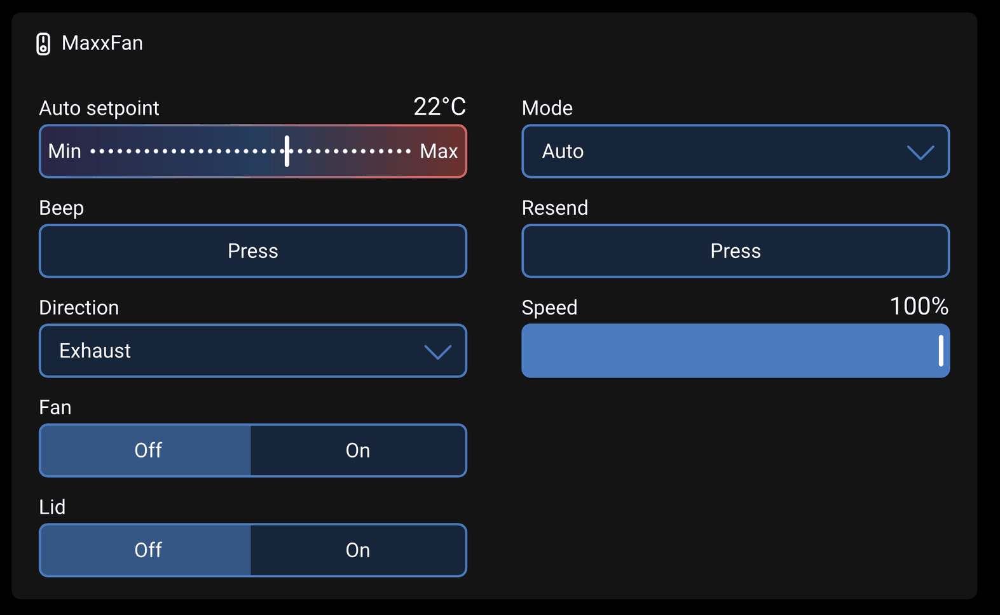

# dbus-maxxfan

Venus OS driver for the MaxxAir MaxxFan Deluxe roof fan, controlled over infrared.
Venus-OS-Treiber für den MaxxAir MaxxFan Deluxe, gesteuert über Infrarot.

**[English](#english) · [Deutsch](#deutsch)**

---

## English

Publishes a MaxxAir MaxxFan Deluxe on the Venus OS D-Bus as
`com.victronenergy.switch`, so the fan gets its own card in the switch pane of
the GX display, the remote console and VRM — even though it has no data
connection of any kind.

Commands reach the fan the same way the hand held remote sends them: as infrared.
An Arduino with an infrared LED, running the sketch in [`arduino/`](arduino/),
hangs on a USB serial port of the GX device and does the transmitting.

### What the driver publishes

One card named *MaxxFan*, holding eight controls:



| Output | Type | Content |
|---|---|---|
| `fan` | toggle | Fan on / off |
| `speed` | basic slider | 10 … 100 %, in steps of ten |
| `direction` | dropdown | Intake / Exhaust |
| `cover` | toggle | Lid open / closed |
| `mode` | dropdown | Manual / Auto (thermostat) |
| `setpoint` | temperature setpoint | −2 … 37 °C, the thermostat's target |
| `resend` | momentary | Transmit the current state again |
| `beep` | momentary | Make the fan beep twice, to find it or test the path |
| `update` | momentary | Shows both firmware versions, and flashes the Arduino |

Every control also appears under `/SwitchableOutput/<name>/…` on D-Bus, so
Node-RED and MQTT can read and write the same values.

The service is named after the port the Arduino got — `maxxfan_ttyUSB0` in the
examples below, but `ttyUSB1` as soon as something else enumerates first, and it
can change across reboots. `dbus -y | grep maxxfan` gives the current one. The
*device instance* is stable: it lives in
`/Settings/Devices/maxxfan/ClassAndVrmInstance`.

The type of each control can be changed from the GX device page, and the change
is stored — if the slider for the speed does not suit you, set it to a dimmer
instead. `ValidTypes` lists what each output allows.

**A note on language.** The labels above are plain text the driver publishes, so
they stay English whatever the GX is set to — while the words the interface
supplies itself (*on/off*, *press*, *min/max*) follow the device's language
setting. On a German GX the card therefore reads half English. A driver cannot
translate its own labels, but you can rename every control and it is stored:

```bash
S=com.victronenergy.switch.maxxfan_ttyUSB0
dbus -y $S /SwitchableOutput/fan/Settings/CustomName SetValue "Lüfter"
dbus -y $S /SwitchableOutput/speed/Settings/CustomName SetValue "Drehzahl"
```

The entries of the two dropdowns come from `Settings/Labels` and stay as the
driver sets them.

### Infrared only goes one way

The fan never answers. Everything the GX display shows is **the state the driver
last transmitted**, not a reading. If somebody uses the hand held remote, the two
drift apart until the next command from the GX — which, because the protocol
carries the complete state in every packet, immediately puts the fan back in
step with the display.

Two consequences worth knowing:

- **The driver does not transmit at startup.** Re-sending the stored state on
  every reboot of the GX would start a fan that somebody deliberately switched
  off by hand. The state is published, not sent.
- **Nothing is transmitted unless somebody asks for it.** There is a periodic
  re-send in the driver (`REFRESH_S`, in seconds) and it ships switched off. It
  was meant to bring a fan operated by hand back under GX control, but with no
  way back over infrared the driver can never tell whether the fan agrees with
  it, so re-asserting is a blind write - and a blind write eventually undoes
  something a person just did. Switching it on means accepting that the fan can
  start by itself a quarter of an hour after somebody switched it off at the
  fan. *Resend* does the same thing at a moment when it was asked for.

Because the protocol has no "speed only" message, every change transmits all
eight fields. Changes are collected for 600 ms first, so dragging the speed
control produces one packet rather than twenty.

### Installation

Three routes. The first needs no console, no SSH and nothing typed anywhere.

#### From a USB stick

Venus OS unpacks archives it finds on removable media at boot, and
[SetupHelper](https://github.com/kwindrem/SetupHelper)'s Package manager
installs package archives lying next to them. Two files and an empty third one
turn that into a complete install on a GX device that has never been touched.

You need a USB stick or SD card, **formatted FAT32**, and two downloads:

1. [`maxxfan-usb.zip`](https://github.com/mcgyver78/dbus-maxxfan/releases/download/usb/maxxfan-usb.zip)
   — this driver, packed the way Package manager expects it
2. [`venus-data-SetupHelperInstall.tgz`](https://github.com/kwindrem/SetupHelper/raw/main/venus-data-SetupHelperInstall.tgz)
   — SetupHelper itself, from its own repository. Nothing happens without it.

Unzip the first one onto the stick and drop the second next to it. The stick
has to end up looking exactly like this — everything loose on the stick, not
inside a folder:

```
USB stick
├── venus-data-SetupHelperInstall.tgz
├── dbus-maxxfan-latest.tar.gz
└── AUTO_INSTALL_PACKAGES        <- empty file; its presence is the instruction
```

Then: stick into the GX device, power it off and on, wait for the display to
come back — a few minutes, noticeably longer than a normal start — and pull
the stick out. *Settings* now has *Package manager* at the bottom, and the fan
appears in the switch pane as soon as the Arduino is plugged into a USB port.
A bare Arduino is flashed on the spot; see
[below](#updating-the-arduino-from-the-gx).

If the fan does not appear, leave the stick in and reboot once more: on some
firmware versions SetupHelper arrives too late in the first boot to notice the
package sitting beside it.

Two things trip people up. Safari unpacks `.tgz` files by itself — turn off
*Open safe files after downloading* in its settings and download again. And an
unzipper that creates a folder has put the files one level too deep; the
listing above is what the stick must look like.

The zip is rebuilt by a workflow on every change, so that link always carries
the current version. `tools/make-usb-zip.sh` builds the same thing locally.
SetupHelper's own installer is not in the zip because its repository carries no
licence, so it is not this project's to redistribute.

#### From the Package manager

For a GX device that already has SetupHelper. *Settings → Package manager →
Inactive packages → new*, and enter:

| Field | Value |
|---|---|
| Package name | `dbus-maxxfan` |
| GitHub user | `mcgyver78` |
| GitHub branch or tag | `latest` |

Then *Proceed* → *Install*.

#### Manually

SetupHelper is needed either way — the setup script is a thin wrapper around it.
This route only skips the Package manager screen.

```bash
cd /data
git clone https://github.com/mcgyver78/dbus-maxxfan.git
/data/dbus-maxxfan/setup
```

#### Staying up to date

The package ships an empty `AUTO_INSTALL` file, which SetupHelper reads as
"install a new version of this package as soon as one arrives" — whether it
came from GitHub or from a stick, and whether or not automatic installs are
switched on for everything else. It only speaks for this package.

Fetching new versions is a system-wide decision and stays one:
`/Settings/PackageManager/GitHubAutoDownload` is `0` (off, version checks
still happen) by default, and `1` fast, `2` hourly, `3` daily are the
alternatives. Set it in the Package manager menu, and updates arrive and
install themselves. Venus OS firmware updates wipe the installed files;
SetupHelper puts every package back afterwards on its own.

### Requirements

- Venus OS v3.70 or newer with the **new user interface** enabled — the switch
  pane is a gui-v2 feature. On the classic interface the device appears in the
  device list, but its controls are not drawn.
- Python 3 and `pyserial`, both shipped with Venus OS
- An Arduino on a USB port of the GX device, flashed with
  [`arduino/maxxfan_tx`](arduino/maxxfan_tx)

### Hardware

```
  +-----------+   USB serial    +----------------+   38 kHz IR   +-----------+
  |  Cerbo GX |<--------------->|  Arduino Nano  | ~~~~~~~~~~~~> |  MaxxFan  |
  |           |     115200      |   maxxfan_tx   |    940 nm     |   Deluxe  |
  +-----------+                 +----------------+               +-----------+
        ^                                                              :
        | D-Bus, switch pane                nothing comes back - see "Not implemented"
```

| Part | Note |
|---|---|
| ATmega328P board | classic Nano, Uno or Pro Mini. Not a Nano Every and not an ESP: the sketch drives timer 1 directly |
| Infrared LED, 940 nm | e.g. TSAL6200, or the LED of a KY-005 module |
| Resistor 180 … 220 Ω | sets the LED current to roughly 20 mA |
| USB cable to the GX device | a data cable, not a charging cable |

That is the entire circuit:

```
   D9 (OC1A) --[ 180 ... 220 R ]--|>|-- GND
                                 IR LED
                            anode       cathode
                          (long leg)   (short leg, flat side)
```

**Pin 9 is not a free choice.** The 38 kHz carrier is generated by timer 1 in
hardware, and timer 1 drives that pin. Doing the carrier in hardware is also the
reason this sketch does not disable interrupts: a packet is 176 symbols long and
occupies the LED for about 150 ms, and a sketch that bit-bangs the carrier has to
block interrupts for that whole window — losing every serial byte that arrives in
it. Here the serial port keeps running while a packet is on the air.

**Range.** Driven straight from the pin the LED runs at about 20 mA, good for a
metre or two. That is plenty, because the LED belongs right next to the fan's own
receiver window anyway. If you want more, drive it through an NPN transistor
(BC337, 2N3904) from 5 V with 22 … 47 Ω — the carrier is only a third duty cycle
and a packet lasts 150 ms, so the LED takes the higher pulse current easily.

**Where it goes.** The LED at the fan, the USB cable to the GX device. Ordinary
USB is good for about three metres; beyond that use an active cable.

**Current state: transmit only.** There is no receiver in the circuit, so what
somebody does with the hand held remote is invisible to the driver. Adding one
means a 38 kHz receiver module (TSOP38238, TSOP4838 or VS1838B) with its output
on D2 — see [Not implemented](#not-implemented).

Flash the sketch with the Arduino IDE — board *Arduino Nano*, processor
*ATmega328P*, or *ATmega328P (Old Bootloader)* on most clones — or with
`arduino-cli`. No libraries are needed. It compiles to about 3.4 KB, a tenth of
the flash.

#### Flashing it, and what goes wrong

Every one of these cost time here, so they are written down rather than
rediscovered.

| Symptom | Cause |
|---|---|
| `bad CPU type in executable` while compiling | Apple Silicon without Rosetta — the AVR toolchain is Intel only. `softwareupdate --install-rosetta --agree-to-license` |
| `expected unqualified-id before '<' token` | the `.ino` contains HTML. It was copied from the rendered GitHub page instead of the file; use the *Raw* button or the clone |
| No *Processor* entry in the *Tools* menu | wrong board. `ATmega328P Xplained Mini` is the same chip on a different platform and has no bootloader options. It must be *Arduino Nano* from *Arduino AVR Boards* — the first line of the verbose output has to read `FQBN: arduino:avr:nano` |
| `stk500_recv(): programmer is not responding`, `not in sync` | older board with the old bootloader: *Tools → Processor → ATmega328P (Old Bootloader)* |
| `cannot open port …: No such file or directory` | the board dropped off the bus. Re-plug it and pick the port again — the IDE holds on to a stale selection |
| The size summary appears but no avrdude output at all | *Verify* was pressed, not *Upload*. Both print the summary, only *Upload* runs avrdude |
| Upload fails although the port exists | the serial monitor is holding the port. Close it first |
| No port under *Tools → Port* at all | nearly always a charge-only USB cable. The board selection has no influence on whether a port appears |
| No reply in the serial monitor | 115200 baud, and the line ending must be *Newline*. Without it the sketch never sees a complete command |

On macOS pick the **`/dev/cu.…`** port, not `/dev/tty.…` — the tty variant blocks
until the device asserts DCD, and the upload then hangs without an error.

The board here is an FTDI Nano, which carries a unique serial number and shows up
as `usb-FTDI_FT232R_USB_UART_<serial>-if00-port0`. CH340 clones usually have none,
which is why the driver verifies the port by asking rather than by name.

#### Serial protocol

115200 8N1, one command per line:

```
?                                                     -> MAXXFAN 1 1.3
S <on> <speed> <exhaust> <cover> <auto> <degF> <warn> -> OK <32 hex digits>
R                                                     -> OK <32 hex digits>
```

`S` builds the packet, transmits it and echoes it back as hex, so the driver can
log exactly what went out. `R` repeats the last packet unchanged. Values out of
range are refused with `ERR` rather than sent. The setpoint is given in
Fahrenheit here because that is the unit on the wire; the driver converts.

The identification query is what makes the port safe to find. The driver globs
`/dev/serial/by-id/` for CH340, FTDI, CP210x and Arduino names, and then asks
each candidate to identify itself before sending it a single command.

Those are chip names, not device names, and the distinction matters: Victron's
VE.Direct-USB and MK3-USB cables carry their own descriptors and never match,
but the **RS485-to-USB interface** — the cable that connects a Carlo Gavazzi
grid meter — is a plain FTDI FT232R and looks exactly like an Arduino in the
by-id listing. A match is therefore only ever a reason to ask, never a reason to
act. See [Serial starter](#serial-starter) for what that means in practice.

### Updating the Arduino from the GX

Venus OS has no avrdude, and does not need one: the bootloader the Arduino IDE
talks to speaks STK500v1, and [`tools/flash.py`](tools/flash.py) implements
enough of it to program an ATmega328P over pyserial. Once the transmitter is
plugged into the GX device, it never has to go back to a laptop.

**Where the versions are.** The device page shows the sketch under *Firmware
version* and the driver in the *Connection* row. On the card, the element in
the bottom right carries both:

```
Transmitter 1.3 (up to date)
Transmitter 1.2 (update to 1.3)      <- press to flash
Transmitter pre-1.3 (update to 1.3)  <- a sketch older than this mechanism
```

It sorts after *Speed* because the card orders its controls by label, which is
why it sits out of the way of the fan controls. Rename it and the driver stops
touching the label.

**When the driver flashes on its own.** Never on a version mismatch, and never
because a board is new: an update is always a button press. There are three
cases where it programs a board unasked, and they all come down to knowing
whose board it is.

*The port it already knows.* If the port that identified as ours last time now
has a bootloader but no working sketch - an update that was interrupted - the
driver finishes the job at startup. This is also what makes a spare board a
drop-in replacement: pull the Arduino, plug in a bare one, and it is running
the sketch a moment later. Whether the new board really lands on the same port
depends on the USB chip. CH340 clones usually carry no serial number, so every
one of them appears under the same `/dev/serial/by-id` name and a swap just
works; FTDI and CP210x have unique serial numbers, so a replacement is a
different name and the driver leaves it alone. The flip side of the CH340
behaviour is that two of them on one GX cannot be told apart.

*The first board on a fresh installation.* Here nothing identifies itself, so
no service appears, so there is no button to press - the sketch would have to
come from a laptop. So when no port is remembered at all and no MaxxFan answers
anywhere, the driver flashes the single AVR bootloader it finds among the
candidate ports. Exactly one: two AVRs and it keeps its hands off. This is
tried once per installation and the attempt is recorded in
`/Settings/Devices/maxxfan/AdoptAttempted`, so a board that cannot be flashed
is not reset every time the service restarts. Clear that setting to let it try
again.

*A port you named yourself.* `dbus-maxxfan.py /dev/serial/by-id/usb-...` flashes
a bare board on that port, because naming it says whose it is.

Anywhere else a bootloader is not enough. It only says "an AVR lives here", not
whose project it runs, and the last thing this driver should do is overwrite
somebody's other Arduino.

**What cannot be updated this way:** a board whose bootloader was erased (needs
an ISP programmer), one with auto-reset disabled - cutting RESET-EN is a common
trick to stop the board rebooting when a port is opened, and it stops flashing
too - and anything that is not an ATmega328P or 168, which the signature check
rejects. One case fails silently: a sketch built for 16 MHz running on an 8 MHz
board reports its version happily and transmits infrared at half speed. A
signature cannot tell clock rates apart.

An interrupted write cannot brick the board. The bootloader sits in a protected
section of flash and cannot overwrite itself, so the worst case is a broken
sketch and a working bootloader - exactly the state the repair path above is
for.

**Keeping the firmware in step.** `arduino/maxxfan_tx.hex` is what gets flashed,
so it has to match the sketch; a stale one would make the card offer an update
that installs something older. [`tools/build-hex.sh`](tools/build-hex.sh)
rebuilds it and the version file from `SKETCH_VERSION`, and
[`tools/check-hex.py`](tools/check-hex.py) — which a GitHub workflow runs on
every change — verifies that they agree.

The check reads the version string **out of the committed `.hex`**, where the
sketch's identify reply puts it, rather than comparing against a fresh build.
Two toolchain versions produce different binaries from identical source, so a
byte comparison fails for reasons that have nothing to do with the firmware
being current. Bump `SKETCH_VERSION` whenever you change the sketch, and the
check has something to catch.

### Why `switch` and not a fan service

Venus OS has no service class for a ventilation fan. `com.victronenergy.switch`
is the one the GUI scans for `/SwitchableOutput/x/…`, and it offers exactly the
controls this device needs: toggles, a stepped value, dropdowns with labels, a
temperature setpoint and momentary buttons. The same API is what the GX IO
extender, Node-RED virtual switches and third party digital switches use, so the
fan sits on the switch pane next to them and needs no GUI modification at all.

### Protocol

38 kHz carrier, one third duty. The bit stream looks like RS232: one start bit,
eight data bits least significant first, two stop bits. A **mark encodes a zero
and a space encodes a one**, each symbol **834 µs** long. Sixteen bytes, no
framing beyond that:

| Byte | Content |
|---|---|
| 0–9 | fixed preamble `5A A5 80 7F 40 BF 20 DF 10 CC` |
| 10 | state bits |
| 11 | speed, 0 … 100 in steps of ten |
| 12 | thermostat setpoint in °F |
| 13 | always `FF` |
| 14 | always `23` |
| 15 | XOR of bytes 10 … 14 |

State byte 10:

| Bit | Meaning |
|---|---|
| 0 (0x01) | fan on |
| 1 (0x02) | special — see below |
| 2 (0x04) | direction: 0 intake, 1 exhaust |
| 3 (0x08) | lid open |
| 4 (0x10) | auto mode (thermostat) |
| 5 (0x20) | warn — the fan beeps twice |

The **special bit** overrides the fan's own coupling of lid and motor. It is set
in thermostat mode, and for ceiling fan mode — running with the lid closed —
which the fan otherwise refuses. The sketch derives it as
`auto || (on && !lid_open)`, which matches all 99 reference recordings.

Every packet carries the complete state. There are no incremental commands, and
that is why a driver for this fan has to remember what it last sent.

#### The setpoint is stored in Fahrenheit

The remote displays Celsius but transmits Fahrenheit, and the conversion it uses
**truncates towards zero**:

```
degF = trunc(degC × 1.8) + 32
```

That is not the same as rounding. A rounded conversion is off by one degree
Fahrenheit on 18 of the 40 setpoints in the −2 … 37 °C range — 21 °C becomes
70 °F instead of the 69 °F the remote sends. The driver uses the truncating form, so a setpoint entered on
the GX matches the one shown on the fan.

#### Verified against the original remote

[`tools/verify-encoder.py`](tools/verify-encoder.py) decodes the 99 signals that
[skypeachblue](https://github.com/skypeachblue/maxxfan-reversing) captured from
an original remote with a Flipper Zero, re-encodes each one and compares the
result symbol by symbol:

```bash
python3 tools/verify-encoder.py Maxxfan_collection.ir
```

All 99 reproduce exactly. [`tools/test-driver-logic.py`](tools/test-driver-logic.py)
covers the other half — it fakes the D-Bus service with the same accept/reject
semantics vedbus really has and checks that a control which sends step numbers
is refused rather than stored, that a failed transmit is retried and then gives
up, that a port which does not identify is handed back to serial-starter, and
that a stored value the fan cannot do is snapped into range. Both run without a
GX device.

The capture comparison is also where the 834 µs symbol period
and the truncating temperature conversion come from — both differ from the
widely used [ESPHome component](https://github.com/brown-studios/esphome-maxxfan-protocol),
which the fan accepts as well, but matching the original leaves the widest
margin on a weak or off-axis infrared path.

### Serial starter

Venus OS attaches a service to every new `ttyUSB` and probes it for VE.Direct and
MK2. That probing toggles DTR, which on an Arduino means a reset, so the port has
to be taken away from serial-starter before the driver can use it.

The driver does that **for one port at a time, and only around the question**:
it releases a candidate with `stop-tty.sh`, asks it to identify itself, and if
the answer is not `MAXXFAN` it calls `start-tty.sh` and hands the port straight
back. A foreign device loses its Venus driver for about a second instead of
until the next reboot. The port that did answer is remembered in the settings,
so from the second start onwards no other port is touched at all.

A port another driver has already claimed is skipped entirely — not probed,
not stopped, not handed back. serial-starter keeps a node under
`/dev/serial-starter` for every tty it still manages, and a driver that claims
a port removes it, so a candidate without that node is not free but taken. This
matters on a real GX: an Autoterm heater sits on an FTDI and a Victron
Buck-Boost on a CP210x, and both match the candidate patterns above. Handing
such a port back would be worse than the probe itself — the other driver keeps
running while its port fills up with VE.Direct and MK2 probes again, and it has
no way of noticing. Measured on a Cerbo: a heater driver sharing its port that
way answered 2 of 30 queries instead of 29 of 29.

For the same reason the driver opens the port once and keeps it open; re-opening
it per command would reboot the transmitter every time.

**The permanent fix, if you want one.** Releasing a port at all is a workaround.
The Venus way to keep serial-starter off a specific device is a udev rule keyed
on its serial number — your Arduino has one, an FTDI always does:

```bash
/opt/victronenergy/swupdate-scripts/remount-rw.sh
echo 'ACTION=="add", ENV{ID_BUS}=="usb", ENV{ID_SERIAL_SHORT}=="A50285BI", ENV{VE_SERVICE}="ignore"' \
    >> /etc/udev/rules.d/serial-starter.rules
udevadm control --reload
```

Substitute your own serial number — the driver logs the by-id path it found, and
the serial is the part before `-if00`. This survives replugging but not a
firmware update, because the root filesystem is replaced; the driver's own
release still covers that case.

### Troubleshooting

**Nothing appears in the device list.** Look at the log first:

```bash
tail -f /var/log/dbus-maxxfan/current
```

`no MaxxFan transmitter on this port` means a port was found but did not
identify itself — usually the sketch is not flashed, or the wrong board is
plugged in. `no candidate USB serial port` means no CH340, FTDI, CP210x or
Arduino device is present at all.

**The device is there but has no controls.** The switch pane needs the new user
interface. Check *Settings → Display* on the GX, or the Remote Console.

**Commands are accepted but the fan does not react.** Check the infrared path
first with the *Beep* button — it is the cheapest test there is, because it
changes nothing else. If the fan stays silent, the LED is not reaching the
receiver: too far, too far off axis, or the resistor is too large. The remote
itself works over a couple of metres, so aim the LED at the fan's own receiver
window rather than at the ceiling.

**The GX shows a state the fan is not in.** Somebody used the hand held remote.
Press *Resend*.

**The speed control does nothing, and the fan beeps at every step.** The control
was configured as a *stepped switch*. That type sends the number of the position
it sits on — 1 to 7 — and ignores the minimum, maximum and step size a driver
publishes, so every position arrives as a single digit. The driver refuses those
values and says so in the log. Put it back to the basic slider:

```bash
dbus -y com.victronenergy.switch.maxxfan_ttyUSB0 \
     /SwitchableOutput/speed/Settings/Type SetValue 7
```

That is also why the stepped switch is not offered for the speed any more.

**Testing by hand.** Stop the service first — two processes on one serial port
means both see garbage:

```bash
svc -d /service/dbus-maxxfan
sleep 2
# the port the driver identified, not just the first candidate
PORT=$(grep -o '/dev/serial/by-id/[^ ]*' /var/log/dbus-maxxfan/current | tail -1)
python3 -c "
import serial, time
s = serial.Serial('$PORT', 115200, timeout=2); time.sleep(2)
s.write(b'?\n'); print(s.readline())
s.write(b'S 1 50 1 1 0 69 0\n'); print(s.readline())"
svc -u /service/dbus-maxxfan
```

### Not implemented

- **No feedback.** An infrared receiver on the Arduino could decode what the hand
  held remote sends and keep the driver in step. The sketch would only need a
  decoder and a report line; the protocol is fully known.
- **No measured temperature.** The setpoint control can display a measured value
  next to the target through `/SwitchableOutput/setpoint/Measurement`. Feeding it
  from an existing Venus temperature sensor would make the auto mode much easier
  to judge.
- **No ceiling fan mode of its own.** Setting the fan on with the lid closed
  produces it, but there is no separate control for it.

### Acknowledgements

Protocol groundwork by [skypeachblue](https://github.com/skypeachblue/maxxfan-reversing)
and [wingspinner](https://github.com/wingspinner), packet layout confirmed
against [brown-studios/esphome-maxxfan-protocol](https://github.com/brown-studios/esphome-maxxfan-protocol).
The idea of driving the fan from an Arduino on the GX comes from the
[Pekaway tutorial](https://pekaway.de/blogs/tutorials/maxxfan-uber-infrarot-steuern)
and [ffroehlcke/maxx-wifi-controller](https://github.com/ffroehlcke/maxx-wifi-controller).

### License

MIT

---

## Deutsch

Meldet einen MaxxAir MaxxFan Deluxe auf dem D-Bus von Venus OS als
`com.victronenergy.switch` an. Damit bekommt der Lüfter eine eigene Karte im
Switch-Pane des GX-Displays, in der Remote Console und im VRM — obwohl er
überhaupt keine Datenverbindung besitzt.

Die Befehle erreichen ihn auf demselben Weg wie die von der Handfernbedienung:
per Infrarot. Ein Arduino mit Infrarot-LED, bespielt mit dem Sketch aus
[`arduino/`](arduino/), hängt an einem USB-Port des GX-Geräts und sendet.

### Was der Treiber liefert

Eine Karte namens *MaxxFan* mit acht Bedienelementen:


| Ausgang | Typ | Inhalt |
|---|---|---|
| `fan` | Schalter | Lüfter ein / aus |
| `speed` | Schieberegler | 10 … 100 %, in Zehnerschritten |
| `direction` | Auswahl | Intake / Exhaust |
| `cover` | Schalter | Deckel offen / zu |
| `mode` | Auswahl | Manual / Auto (Thermostat) |
| `setpoint` | Temperatur-Sollwert | −2 … 37 °C |
| `resend` | Taster | Aktuellen Zustand erneut senden |
| `beep` | Taster | Lüfter zweimal piepen lassen |
| `update` | Taster | Zeigt beide Firmware-Versionen und flasht den Arduino |

Alle Elemente liegen zusätzlich unter `/SwitchableOutput/<name>/…` auf dem D-Bus
und sind damit aus Node-RED und über MQTT les- und schreibbar.

Der Dienstname richtet sich nach dem Port, den der Arduino bekommen hat — unten
steht überall `maxxfan_ttyUSB0`, es kann aber `ttyUSB1` sein, sobald etwas
anderes zuerst erkannt wird, und er kann sich nach einem Neustart ändern.
`dbus -y | grep maxxfan` zeigt den aktuellen. Die *Geräteinstanz* bleibt stabil,
sie steht in `/Settings/Devices/maxxfan/ClassAndVrmInstance`.

Der Typ jedes Elements lässt sich auf der GX-Geräteseite umstellen und wird
gespeichert — wem der Schieberegler für die Drehzahl nicht gefällt, stellt ihn
auf Dimmer um. `ValidTypes` sagt je Ausgang, was erlaubt ist.

**Zur Sprache.** Die Beschriftungen oben sind reiner Text, den der Treiber
veröffentlicht — sie bleiben also englisch, egal worauf das GX eingestellt ist.
Die Wörter, die die Oberfläche selbst beisteuert (*Ein/Aus*, *Drücken*,
*Min/Max*), folgen dagegen der Spracheinstellung des Geräts. Auf einem deutschen
GX liest sich die Karte deshalb halb englisch. Übersetzen kann ein Treiber seine
Beschriftungen nicht, umbenennen lässt sich aber jedes Element, und das wird
gespeichert:

```bash
S=com.victronenergy.switch.maxxfan_ttyUSB0
dbus -y $S /SwitchableOutput/fan/Settings/CustomName SetValue "Lüfter"
dbus -y $S /SwitchableOutput/speed/Settings/CustomName SetValue "Drehzahl"
```

Die Einträge der beiden Auswahllisten kommen aus `Settings/Labels` und bleiben
so, wie der Treiber sie setzt.

### Infrarot geht nur in eine Richtung

Der Lüfter antwortet nie. Was das GX-Display zeigt, ist **der zuletzt gesendete
Zustand**, kein Messwert. Wer die Handfernbedienung benutzt, bringt beide
auseinander — bis zum nächsten Befehl vom GX, der den Lüfter sofort wieder in
Deckung bringt, weil jedes Paket den vollständigen Zustand trägt.

Zwei Punkte, die daraus folgen:

- **Beim Start wird nichts gesendet.** Den gespeicherten Zustand bei jedem
  Neustart des GX erneut zu funken würde einen Lüfter starten, den jemand
  bewusst von Hand ausgeschaltet hat. Der Zustand wird veröffentlicht, nicht
  gesendet.
- **Gesendet wird nur, wenn jemand danach fragt.** Es gibt eine periodische
  Wiederholung im Treiber (`REFRESH_S`, in Sekunden), und sie ist ab Werk aus.
  Gedacht war sie, um einen von Hand bedienten Lüfter wieder unter GX-Kontrolle
  zu bringen — aber ohne Rückweg über Infrarot kann der Treiber nie wissen, ob
  der Lüfter seiner Meinung ist. Die Wiederholung ist also ein Blindschuss, und
  ein Blindschuss macht irgendwann rückgängig, was gerade jemand von Hand
  eingestellt hat. Wer sie einschaltet, nimmt in Kauf, dass der Lüfter eine
  Viertelstunde nach dem Ausschalten am Gerät von selbst wieder anläuft.
  *Resend* macht dasselbe, aber in dem Moment, in dem es gewollt ist.

Weil das Protokoll kein „nur Drehzahl"-Kommando kennt, überträgt jede Änderung
alle acht Felder. Änderungen werden deshalb erst 600 ms gesammelt — am
Drehzahlregler zu ziehen erzeugt so ein Paket statt zwanzig.

### Installation

Drei Wege. Der erste braucht keine Konsole, kein SSH und nichts Getipptes.

#### Vom USB-Stick

Venus OS entpackt beim Start Archive, die es auf einem Wechseldatenträger
findet, und der Package Manager von
[SetupHelper](https://github.com/kwindrem/SetupHelper) installiert
Paketarchive, die daneben liegen. Zwei Dateien und eine leere dritte machen
daraus eine vollständige Installation auf einem GX-Gerät, das noch nie
angefasst wurde.

Gebraucht wird ein USB-Stick oder eine SD-Karte, **FAT32 formatiert**, und
zwei Downloads:

1. [`maxxfan-usb.zip`](https://github.com/mcgyver78/dbus-maxxfan/releases/download/usb/maxxfan-usb.zip)
   — dieser Treiber, so verpackt, wie der Package Manager ihn erwartet
2. [`venus-data-SetupHelperInstall.tgz`](https://github.com/kwindrem/SetupHelper/raw/main/venus-data-SetupHelperInstall.tgz)
   — SetupHelper selbst, aus seinem eigenen Repo. Ohne ihn passiert nichts.

Das erste auf den Stick entpacken, das zweite danebenlegen. So muss der Stick
danach aussehen — alles direkt auf dem Stick, nicht in einem Ordner:

```
USB-Stick
├── venus-data-SetupHelperInstall.tgz
├── dbus-maxxfan-latest.tar.gz
└── AUTO_INSTALL_PACKAGES        <- leere Datei; dass sie da ist, ist die Anweisung
```

Dann: Stick ins GX-Gerät, Strom weg und wieder dran, warten bis die Oberfläche
zurück ist — ein paar Minuten, merklich länger als sonst — und den Stick
abziehen. Unter *Einstellungen* steht jetzt ganz unten *Package manager*, und
der Lüfter erscheint im Schalterbereich, sobald der Arduino an einem USB-Port
steckt. Ein nackter Arduino wird dabei gleich geflasht, siehe
[weiter unten](#den-arduino-vom-gx-aus-aktualisieren).

Erscheint der Lüfter nicht: Stick drinlassen und noch einmal neu starten. Auf
manchen Firmware-Ständen kommt SetupHelper im ersten Start zu spät, um das
Paket neben sich zu bemerken.

Zwei Stolpersteine. Safari entpackt `.tgz`-Dateien von selbst — in den
Einstellungen *Sichere Dateien nach dem Laden öffnen* abschalten und noch
einmal laden. Und ein Entpacker, der einen Ordner anlegt, hat die Dateien eine
Ebene zu tief abgelegt; die Auflistung oben ist, wie der Stick aussehen muss.

Das Zip wird bei jeder Änderung neu gebaut, der Link trägt also immer die
aktuelle Version. `tools/make-usb-zip.sh` baut dasselbe lokal. SetupHelpers
eigener Installer liegt nicht im Zip: Sein Repo führt keine Lizenz, er gehört
diesem Projekt also nicht zum Weiterverteilen.

#### Über den Package Manager

Für ein GX-Gerät, auf dem SetupHelper schon läuft. *Settings → Package manager
→ Inactive packages → new*, und eintragen:

| Feld | Wert |
|---|---|
| Package name | `dbus-maxxfan` |
| GitHub user | `mcgyver78` |
| GitHub branch or tag | `latest` |

Anschließend *Proceed* → *Install*.

#### Manuell

SetupHelper wird so oder so gebraucht — das setup-Skript ist nur eine dünne
Hülle darum. Dieser Weg spart lediglich den Umweg über die Package-Manager-Maske.

```bash
cd /data
git clone https://github.com/mcgyver78/dbus-maxxfan.git
/data/dbus-maxxfan/setup
```

#### Aktuell bleiben

Das Paket bringt eine leere Datei `AUTO_INSTALL` mit. SetupHelper liest das als
„eine neue Version dieses Pakets sofort installieren" — egal ob sie von GitHub
oder von einem Stick kam, und unabhängig davon, ob automatische Installationen
sonst eingeschaltet sind. Sie spricht nur für dieses Paket.

Ob überhaupt neue Versionen geholt werden, ist eine systemweite Entscheidung
und bleibt eine: `/Settings/PackageManager/GitHubAutoDownload` steht
standardmäßig auf `0` (aus, Versionsprüfungen laufen weiter), Alternativen sind
`1` schnell, `2` stündlich, `3` täglich. Im Package-Manager-Menü einstellen,
dann kommen Updates von selbst und installieren sich auch. Venus-OS-Firmware-
Updates löschen die installierten Dateien; SetupHelper setzt danach alle Pakete
von sich aus wieder ein.

### Voraussetzungen

- Venus OS ab v3.70 mit **neuer Oberfläche** — das Switch-Pane gibt es nur in
  gui-v2. In der klassischen Oberfläche taucht das Gerät zwar in der Geräteliste
  auf, seine Bedienelemente werden aber nicht gezeichnet.
- Python 3 und `pyserial`, beides in Venus OS enthalten
- Ein Arduino an einem USB-Port des GX-Geräts mit dem Sketch aus
  [`arduino/maxxfan_tx`](arduino/maxxfan_tx)

### Hardware

```
  +-----------+  USB seriell   +----------------+   38 kHz IR   +-----------+
  |  Cerbo GX |<-------------->|  Arduino Nano  | ~~~~~~~~~~~~> |  MaxxFan  |
  |           |     115200     |   maxxfan_tx   |    940 nm     |   Deluxe  |
  +-----------+                +----------------+               +-----------+
        ^                                                              :
        | D-Bus, Switch-Pane            kein Rueckkanal - siehe "Nicht umgesetzt"
```

| Teil | Anmerkung |
|---|---|
| ATmega328P-Board | klassischer Nano, Uno oder Pro Mini. Kein Nano Every und kein ESP: der Sketch spricht Timer 1 direkt an |
| Infrarot-LED, 940 nm | z. B. TSAL6200, oder die LED eines KY-005-Moduls |
| Widerstand 180 … 220 Ω | stellt den LED-Strom auf rund 20 mA |
| USB-Kabel zum GX-Gerät | ein Datenkabel, kein Ladekabel |

Mehr ist die Schaltung nicht:

```
   D9 (OC1A) --[ 180 ... 220 R ]--|>|-- GND
                                 IR-LED
                            Anode        Kathode
                          (langes Bein) (kurzes Bein, abgeflachte Seite)
```

**Pin 9 ist nicht frei wählbar.** Der 38-kHz-Träger kommt aus Timer 1 in
Hardware, und der bedient genau diesen Pin. Dass der Träger in Hardware entsteht,
ist auch der Grund, warum dieser Sketch die Interrupts nicht abschaltet: Ein
Paket ist 176 Symbole lang und belegt die LED rund 150 ms. Wer den Träger per
Software erzeugt, muss dieses ganze Fenster über die Interrupts sperren — und
verliert jedes serielle Byte, das darin ankommt. Hier läuft die serielle
Schnittstelle weiter, während gesendet wird.

**Reichweite.** Direkt vom Pin getrieben läuft die LED mit etwa 20 mA, das reicht
für ein bis zwei Meter. Mehr braucht es nicht, denn die LED gehört ohnehin direkt
neben das Empfangsfenster des Lüfters. Wer trotzdem mehr will, treibt sie über
einen NPN-Transistor (BC337, 2N3904) aus 5 V mit 22 … 47 Ω — der Träger hat nur
ein Drittel Tastverhältnis und ein Paket dauert 150 ms, den höheren Impulsstrom
steckt die LED locker weg.

**Wohin damit.** Die LED an den Lüfter, das USB-Kabel zum GX-Gerät. Normales USB
trägt etwa drei Meter, darüber hinaus ein aktives Kabel nehmen.

**Aktueller Stand: nur senden.** Ein Empfänger ist nicht verbaut. Was jemand mit
der Handfernbedienung macht, sieht der Treiber deshalb nicht. Dafür bräuchte es
ein 38-kHz-Empfängermodul (TSOP38238, TSOP4838 oder VS1838B) mit dem Ausgang an
D2 — siehe [Nicht umgesetzt](#nicht-umgesetzt).

Geflasht wird mit der Arduino-IDE — Board *Arduino Nano*, Prozessor *ATmega328P*,
bei den meisten Clones *ATmega328P (Old Bootloader)* — oder mit `arduino-cli`.
Bibliotheken sind keine nötig. Kompiliert belegt der Sketch rund 3,4 kB, ein
Zehntel des Flash.

#### Flashen, und was dabei schiefgeht

Jeder dieser Punkte hat hier Zeit gekostet, deshalb stehen sie hier, statt neu
gefunden zu werden.

| Symptom | Ursache |
|---|---|
| `bad CPU type in executable` beim Kompilieren | Apple Silicon ohne Rosetta — die AVR-Toolchain gibt es nur für Intel. `softwareupdate --install-rosetta --agree-to-license` |
| `expected unqualified-id before '<' token` | in der `.ino` steht HTML. Sie wurde von der gerenderten GitHub-Seite kopiert statt aus der Datei; den *Raw*-Button oder den Klon nehmen |
| Kein Eintrag *Prozessor* im Menü *Werkzeuge* | falsches Board. `ATmega328P Xplained Mini` ist derselbe Chip auf einer anderen Plattform und kennt keine Bootloader-Varianten. Es muss *Arduino Nano* aus *Arduino AVR Boards* sein — in der ersten Zeile der ausführlichen Ausgabe muss `FQBN: arduino:avr:nano` stehen |
| `stk500_recv(): programmer is not responding`, `not in sync` | älteres Board mit altem Bootloader: *Werkzeuge → Prozessor → ATmega328P (Old Bootloader)* |
| `cannot open port …: No such file or directory` | das Board ist vom Bus verschwunden. Neu einstecken und den Port erneut auswählen — die IDE hält an der alten Auswahl fest |
| Die Größenangabe erscheint, aber keine avrdude-Ausgabe | es wurde *Überprüfen* gedrückt, nicht *Hochladen*. Beide geben die Größe aus, nur *Hochladen* startet avrdude |
| Upload scheitert, obwohl der Port da ist | der Serial Monitor hält den Port. Vorher schließen |
| Unter *Werkzeuge → Port* taucht gar nichts auf | fast immer ein Ladekabel ohne Datenleitungen. Die Board-Auswahl hat darauf keinen Einfluss |
| Keine Antwort im Serial Monitor | 115200 Baud, und das Zeilenende muss auf *Neue Zeile* stehen. Sonst sieht der Sketch nie ein vollständiges Kommando |

Unter macOS den **`/dev/cu.…`**-Port nehmen, nicht `/dev/tty.…` — die tty-Variante
blockiert, bis das Gerät DCD meldet, und der Upload hängt dann ohne Fehlermeldung.

Das Board hier ist ein FTDI-Nano, der eine eindeutige Seriennummer trägt und als
`usb-FTDI_FT232R_USB_UART_<seriennummer>-if00-port0` erscheint. CH340-Clones haben
meist keine — deshalb prüft der Treiber den Port durch Nachfragen und nicht über
den Namen.

#### Serielles Protokoll

115200 8N1, ein Kommando je Zeile:

```
?                                                     -> MAXXFAN 1 1.3
S <on> <speed> <exhaust> <cover> <auto> <degF> <warn> -> OK <32 Hexziffern>
R                                                     -> OK <32 Hexziffern>
```

`S` baut das Paket, sendet es und gibt es als Hex zurück, damit der Treiber
mitschreiben kann, was tatsächlich rausging. `R` wiederholt das letzte Paket
unverändert. Werte außerhalb des zulässigen Bereichs werden mit `ERR` abgelehnt,
nicht gesendet. Der Sollwert steht hier in Fahrenheit, weil das die Einheit auf
dem Draht ist — der Treiber rechnet um.

Die Typabfrage ist das, was die Portsuche sicher macht. Der Treiber sucht in
`/dev/serial/by-id/` nach CH340-, FTDI-, CP210x- und Arduino-Namen und lässt
jeden Kandidaten sich identifizieren, bevor ein einziges Kommando hinausgeht.

Das sind Chipnamen, keine Gerätenamen, und der Unterschied ist wichtig: Victrons
VE.Direct-USB- und MK3-USB-Kabel bringen eigene Deskriptoren mit und tauchen nie
auf — das **RS485-zu-USB-Interface** dagegen, das Kabel zum Carlo-Gavazzi-Zähler,
ist ein blanker FTDI FT232R und sieht in der by-id-Liste aus wie ein Arduino. Ein
Treffer ist deshalb immer nur ein Grund nachzufragen, nie ein Grund zu handeln.
Was das praktisch heißt, steht unter [Serial-Starter](#serial-starter-1).

### Den Arduino vom GX aus aktualisieren

Venus OS hat kein avrdude und braucht auch keins: Der Bootloader, mit dem die
Arduino-IDE redet, spricht STK500v1, und [`tools/flash.py`](tools/flash.py)
setzt davon so viel um, wie zum Programmieren eines ATmega328P nötig ist - über
pyserial, das auf Venus vorhanden ist. Steckt der Sender einmal am GX-Gerät,
muss er nie wieder an einen Laptop.

**Wo die Versionen stehen.** Auf der Geräteseite steht der Sketch unter
*Firmware version* und der Treiber in der Zeile *Connection*. Auf der Karte
trägt das Element unten rechts beide:

```
Transmitter 1.3 (up to date)
Transmitter 1.2 (update to 1.3)      <- Druck flasht
Transmitter pre-1.3 (update to 1.3)  <- Sketch älter als dieser Mechanismus
```

Es sortiert hinter *Speed*, weil die Karte ihre Elemente nach der Beschriftung
ordnet - deshalb sitzt es abseits der Lüfterbedienelemente. Benennst du es um,
lässt der Treiber die Beschriftung in Ruhe.

**Wann der Treiber von sich aus flasht.** Nie wegen einer Versionsabweichung
und nie, weil ein Board neu ist: Ein Update ist immer ein Knopfdruck. Drei
Fälle programmieren ein Board ungefragt, und alle drei laufen darauf hinaus,
dass klar ist, wessen Board es ist.

*Der Port, den er schon kennt.* Hat der Port, der sich zuletzt als unserer
gemeldet hat, jetzt einen Bootloader, aber keinen funktionierenden Sketch - ein
abgebrochenes Update also -, bringt der Treiber beim Start zu Ende, was
angefangen wurde. Das macht ein Ersatzboard gleich zum Steckteil: alten Arduino
raus, nackten rein, kurz darauf läuft der Sketch. Ob das neue Board wirklich am
selben Port landet, hängt am USB-Chip. CH340-Clones tragen meist keine
Seriennummer, alle erscheinen also unter demselben Namen in
`/dev/serial/by-id`, und der Tausch klappt einfach; FTDI und CP210x haben
eindeutige Seriennummern, ein Ersatzboard heißt dort anders und der Treiber
fasst es nicht an. Die Kehrseite des CH340-Verhaltens: zwei davon an einem GX
lassen sich nicht auseinanderhalten.

*Das erste Board einer frischen Installation.* Hier meldet sich nichts, also
erscheint kein Dienst, also gibt es keinen Knopf zum Drücken - der Sketch müsste
vom Laptop kommen. Ist deshalb überhaupt kein Port gemerkt und antwortet
nirgends ein MaxxFan, flasht der Treiber den einen AVR-Bootloader, den er unter
den Kandidatenports findet. Genau einen: Bei zwei AVRs lässt er die Finger davon.
Das wird einmal pro Installation versucht und in
`/Settings/Devices/maxxfan/AdoptAttempted` vermerkt, damit ein Board, das sich
nicht flashen lässt, nicht bei jedem Neustart des Dienstes zurückgesetzt wird.
Diese Einstellung zurücksetzen, und er versucht es erneut.

*Ein Port, den du selbst nennst.* `dbus-maxxfan.py /dev/serial/by-id/usb-...`
flasht ein nacktes Board an diesem Port - ihn zu nennen sagt, wem er gehört.

Überall sonst reicht ein Bootloader nicht. Er sagt nur "hier wohnt ein AVR",
nicht, wessen Projekt darauf läuft, und das Letzte, was dieser Treiber tun
sollte, ist den Arduino von jemand anderem zu überschreiben.

**Was sich so nicht aktualisieren lässt:** ein Board mit gelöschtem Bootloader
(braucht einen ISP-Programmer), eines mit abgeschaltetem Auto-Reset - die
RESET-EN-Brücke aufzutrennen ist ein verbreiteter Trick, damit das Board beim
Öffnen eines Ports nicht neu startet, und er sperrt das Flashen gleich mit - und
alles, was kein ATmega328P oder 168 ist; das fängt die Signaturprüfung ab. Ein
Fall geht still schief: ein für 16 MHz gebauter Sketch auf einem 8-MHz-Board
meldet brav seine Version und funkt mit halber Symbolzeit. Den Takt kann eine
Signatur nicht unterscheiden.

Kaputtflashen kann man das Board nicht. Der Bootloader liegt in einem
geschützten Flash-Bereich und kann sich nicht selbst überschreiben; schlimmster
Fall ist ein kaputter Sketch bei intaktem Bootloader - genau der Zustand, für
den der Reparaturweg oben da ist.

**Firmware und Sketch zusammenhalten.** Geflasht wird `arduino/maxxfan_tx.hex`,
die Datei muss also zum Sketch passen — eine veraltete würde die Karte ein
Update anbieten lassen, das etwas Älteres installiert.
[`tools/build-hex.sh`](tools/build-hex.sh) baut sie samt Versionsdatei aus
`SKETCH_VERSION` neu, und [`tools/check-hex.py`](tools/check-hex.py) — von einem
GitHub-Workflow bei jeder Änderung ausgeführt — prüft, dass beide
zusammenpassen.

Die Prüfung liest die Versionszeichenkette **aus der committeten `.hex`**, wo
die Identifikationsantwort des Sketches sie ablegt, statt gegen einen frischen
Build zu vergleichen. Zwei Toolchain-Versionen erzeugen aus identischem
Quelltext verschiedene Binärdateien, ein Byte-Vergleich schlägt also aus Gründen
fehl, die mit der Aktualität der Firmware nichts zu tun haben. Beim Ändern des
Sketches `SKETCH_VERSION` hochzählen, dann hat die Prüfung etwas zu greifen.

### Warum `switch` und kein Lüfter-Dienst

Venus OS kennt keine Dienstklasse für einen Lüfter. `com.victronenergy.switch`
ist die, nach deren `/SwitchableOutput/x/…`-Pfaden die Oberfläche sucht, und sie
bietet genau die Elemente, die dieses Gerät braucht: Schalter, einen gestuften
Wert, Auswahllisten mit Beschriftungen, einen Temperatur-Sollwert und Taster.
Dieselbe API benutzen der GX-IO-Extender, die Virtual Switches aus Node-RED und
digitale Schalter von Drittanbietern — der Lüfter sitzt also im Switch-Pane
neben ihnen, ganz ohne GUI-Modifikation.

### Protokoll

38-kHz-Träger, ein Drittel Tastverhältnis. Der Bitstrom sieht aus wie RS232: ein
Startbit, acht Datenbits mit dem niederwertigsten zuerst, zwei Stoppbits. Ein
**Mark kodiert eine Null, ein Space eine Eins**, jedes Symbol **834 µs** lang.
Sechzehn Bytes, mehr Rahmen gibt es nicht:

| Byte | Inhalt |
|---|---|
| 0–9 | feste Präambel `5A A5 80 7F 40 BF 20 DF 10 CC` |
| 10 | Zustandsbits |
| 11 | Drehzahl, 0 … 100 in Zehnerschritten |
| 12 | Thermostat-Sollwert in °F |
| 13 | immer `FF` |
| 14 | immer `23` |
| 15 | XOR der Bytes 10 … 14 |

Zustandsbyte 10:

| Bit | Bedeutung |
|---|---|
| 0 (0x01) | Lüfter an |
| 1 (0x02) | special — siehe unten |
| 2 (0x04) | Richtung: 0 Intake, 1 Exhaust |
| 3 (0x08) | Deckel offen |
| 4 (0x10) | Auto-Modus (Thermostat) |
| 5 (0x20) | warn — der Lüfter piept zweimal |

Das **special-Bit** hebt die eingebaute Kopplung von Deckel und Motor auf. Es ist
im Thermostatbetrieb gesetzt und im Ceiling-Fan-Modus — Lüfter an bei
geschlossenem Deckel —, den der Lüfter sonst verweigert. Der Sketch leitet es als
`auto || (on && !deckel_offen)` ab; das stimmt mit allen 99 Referenzaufnahmen
überein.

Jedes Paket trägt den kompletten Zustand. Inkrementelle Kommandos gibt es nicht,
und genau deshalb muss ein Treiber für dieses Gerät sich merken, was er zuletzt
gesendet hat.

#### Der Sollwert steht in Fahrenheit

Die Fernbedienung zeigt Celsius an, überträgt aber Fahrenheit — und rechnet dabei
**gegen null abgeschnitten** um:

```
degF = trunc(degC × 1,8) + 32
```

Das ist nicht dasselbe wie Runden. Gerundet liegt man bei 20 der 38 Sollwerte um
ein Grad Fahrenheit daneben — bei 18 der 40 Werte im Bereich −2 … 37 °C: aus
21 °C würden 70 °F statt der 69 °F, die die Fernbedienung sendet. Der Treiber schneidet ab, damit ein am GX eingestellter
Sollwert dem entspricht, den der Lüfter anzeigt.

#### Geprüft gegen die Originalfernbedienung

[`tools/verify-encoder.py`](tools/verify-encoder.py) dekodiert die 99 Signale,
die [skypeachblue](https://github.com/skypeachblue/maxxfan-reversing) mit einem
Flipper Zero von einer Originalfernbedienung aufgezeichnet hat, kodiert jedes neu
und vergleicht Symbol für Symbol:

```bash
python3 tools/verify-encoder.py Maxxfan_collection.ir
```

Alle 99 stimmen exakt. [`tools/test-driver-logic.py`](tools/test-driver-logic.py)
deckt die andere Hälfte ab: Es bildet den D-Bus-Dienst mit derselben
Annehmen/Ablehnen-Logik nach, die vedbus tatsächlich hat, und prüft, dass ein
Bedienelement, das Stufennummern schickt, abgelehnt statt gespeichert wird, dass
eine fehlgeschlagene Sendung wiederholt wird und der Dienst danach aufgibt, dass
ein Port ohne Identifikation an den serial-starter zurückgeht und dass ein
gespeicherter Wert, den der Lüfter nicht kann, in den zulässigen Bereich gerückt
wird. Beides läuft ohne GX-Gerät.

Aus dem Vergleich mit den Aufnahmen stammen auch die 834 µs Symbolzeit
und die abschneidende Temperaturumrechnung — beides weicht von der verbreiteten
[ESPHome-Komponente](https://github.com/brown-studios/esphome-maxxfan-protocol)
ab, die der Lüfter zwar ebenfalls akzeptiert; nah am Original zu bleiben lässt
aber den größten Spielraum bei schwacher oder schräger Infrarotstrecke.

### Serial-Starter

Venus OS hängt an jedes neue `ttyUSB` einen Dienst und probiert VE.Direct und
MK2 durch. Dieses Abtasten zieht DTR, und das heißt bei einem Arduino: Reset. Der
Port muss dem serial-starter also entzogen werden, bevor der Treiber ihn nutzen
kann.

Das tut der Treiber **für genau einen Port und nur um die Frage herum**: Er gibt
einen Kandidaten mit `stop-tty.sh` frei, lässt ihn sich identifizieren, und wenn
die Antwort nicht `MAXXFAN` lautet, ruft er `start-tty.sh` und gibt den Port
sofort zurück. Ein fremdes Gerät verliert seinen Venus-Treiber damit für etwa
eine Sekunde statt bis zum nächsten Neustart. Der Port, der geantwortet hat,
steht danach in den Settings — ab dem zweiten Start wird kein anderer mehr
angefasst.

Einen Port, den ein anderer Treiber bereits für sich beansprucht hat, fasst er
gar nicht erst an — weder abtasten noch freigeben noch zurückgeben. Der
serial-starter führt unter `/dev/serial-starter` für jedes tty, das er noch
verwaltet, einen Eintrag; wer einen Port übernimmt, entfernt ihn. Ein Kandidat
ohne diesen Eintrag ist also nicht frei, sondern belegt. Das ist auf einem
echten GX kein Randfall: eine Autoterm-Heizung hängt an einem FTDI, ein Victron
Buck-Boost an einem CP210x, und beide passen auf die Muster oben. Den Port
zurückzugeben wäre schlimmer als das Abtasten selbst — der andere Treiber läuft
weiter, während sich seine Leitung wieder mit VE.Direct- und MK2-Anfragen
füllt, und er kann es nicht bemerken. Am Cerbo gemessen: ein Heizungstreiber,
der sich seinen Port so teilt, beantwortet 2 von 30 Abfragen statt 29 von 29.

Aus demselben Grund öffnet der Treiber den Port einmal und hält ihn offen — ihn
pro Kommando neu zu öffnen würde den Sender jedes Mal neu starten.

**Die dauerhafte Lösung, wenn du eine willst.** Einen Port überhaupt freizugeben
ist ein Behelf. Der Venus-Weg, serial-starter von einem bestimmten Gerät
fernzuhalten, ist eine udev-Regel auf die Seriennummer — dein Arduino hat eine,
FTDI-Chips haben immer eine:

```bash
/opt/victronenergy/swupdate-scripts/remount-rw.sh
echo 'ACTION=="add", ENV{ID_BUS}=="usb", ENV{ID_SERIAL_SHORT}=="A50285BI", ENV{VE_SERVICE}="ignore"' \
    >> /etc/udev/rules.d/serial-starter.rules
udevadm control --reload
```

Die eigene Seriennummer einsetzen — der Treiber schreibt den gefundenen
by-id-Pfad ins Log, die Seriennummer ist der Teil vor `-if00`. Das übersteht
Umstecken, aber kein Firmware-Update, weil das Root-Dateisystem ersetzt wird;
dafür greift dann wieder die Freigabe durch den Treiber.

### Fehlersuche

**In der Geräteliste taucht nichts auf.** Zuerst ins Log schauen:

```bash
tail -f /var/log/dbus-maxxfan/current
```

`no MaxxFan transmitter on this port` heißt, ein Port wurde gefunden, hat sich
aber nicht identifiziert — meist ist der Sketch nicht geflasht oder das falsche
Board steckt. `no candidate USB serial port` heißt, es ist überhaupt kein CH340-,
FTDI-, CP210x- oder Arduino-Gerät da.

**Das Gerät ist da, hat aber keine Bedienelemente.** Das Switch-Pane braucht die
neue Oberfläche. Unter *Settings → Display* am GX oder in der Remote Console
nachsehen.

**Kommandos werden angenommen, der Lüfter reagiert nicht.** Die Infrarotstrecke
zuerst mit dem *Beep*-Taster prüfen — der billigste Test überhaupt, weil er sonst
nichts verändert. Bleibt der Lüfter still, kommt die LED nicht an: zu weit, zu
schräg, oder der Vorwiderstand ist zu groß. Die Originalfernbedienung schafft ein
paar Meter, also die LED auf das Empfängerfenster des Lüfters richten und nicht
irgendwohin an die Decke.

**Das GX zeigt einen Zustand, in dem der Lüfter nicht ist.** Da war die
Handfernbedienung am Werk. *Resend* drücken.

**Der Drehzahlregler bewirkt nichts, der Lüfter piept bei jeder Stufe.** Dann
steht das Element auf *Stufenschalter*. Dieser Typ überträgt die Nummer der
Position, auf der er steht — 1 bis 7 — und ignoriert Minimum, Maximum und
Schrittweite, die der Treiber angibt; jede Stufe kommt also als einstellige Zahl
an. Der Treiber weist solche Werte ab und schreibt es ins Log. Zurück auf den
Schieberegler:

```bash
dbus -y com.victronenergy.switch.maxxfan_ttyUSB0 \
     /SwitchableOutput/speed/Settings/Type SetValue 7
```

Aus demselben Grund wird der Stufenschalter für die Drehzahl gar nicht mehr
angeboten.

**Von Hand testen.** Vorher den Dienst stoppen — zwei Prozesse auf einem
seriellen Port bedeuten für beide Müll:

```bash
svc -d /service/dbus-maxxfan
sleep 2
# der Port, den der Treiber identifiziert hat, nicht einfach der erste Kandidat
PORT=$(grep -o '/dev/serial/by-id/[^ ]*' /var/log/dbus-maxxfan/current | tail -1)
python3 -c "
import serial, time
s = serial.Serial('$PORT', 115200, timeout=2); time.sleep(2)
s.write(b'?\n'); print(s.readline())
s.write(b'S 1 50 1 1 0 69 0\n'); print(s.readline())"
svc -u /service/dbus-maxxfan
```

### Nicht umgesetzt

- **Keine Rückmeldung.** Ein Infrarotempfänger am Arduino könnte mitlesen, was
  die Handfernbedienung sendet, und den Treiber nachführen. Der Sketch bräuchte
  dafür nur einen Dekoder und eine Meldezeile — das Protokoll ist vollständig
  bekannt.
- **Keine Ist-Temperatur.** Das Sollwert-Element kann über
  `/SwitchableOutput/setpoint/Measurement` einen Messwert neben dem Sollwert
  anzeigen. Aus einem vorhandenen Venus-Temperatursensor gespeist, wäre der
  Auto-Modus deutlich besser zu beurteilen.
- **Kein eigener Ceiling-Fan-Modus.** Lüfter an bei geschlossenem Deckel erzeugt
  ihn, ein eigenes Bedienelement dafür gibt es nicht.

### Dank

Protokoll-Vorarbeit von [skypeachblue](https://github.com/skypeachblue/maxxfan-reversing)
und [wingspinner](https://github.com/wingspinner), Paketaufbau gegengeprüft mit
[brown-studios/esphome-maxxfan-protocol](https://github.com/brown-studios/esphome-maxxfan-protocol).
Die Idee, den Lüfter von einem Arduino am GX aus zu steuern, stammt aus dem
[Pekaway-Tutorial](https://pekaway.de/blogs/tutorials/maxxfan-uber-infrarot-steuern)
und von [ffroehlcke/maxx-wifi-controller](https://github.com/ffroehlcke/maxx-wifi-controller).

### Lizenz

MIT
